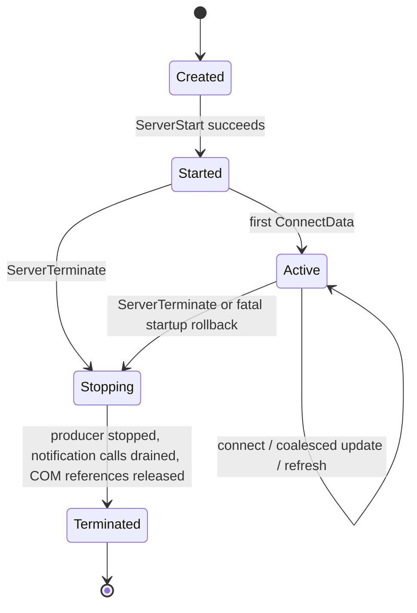
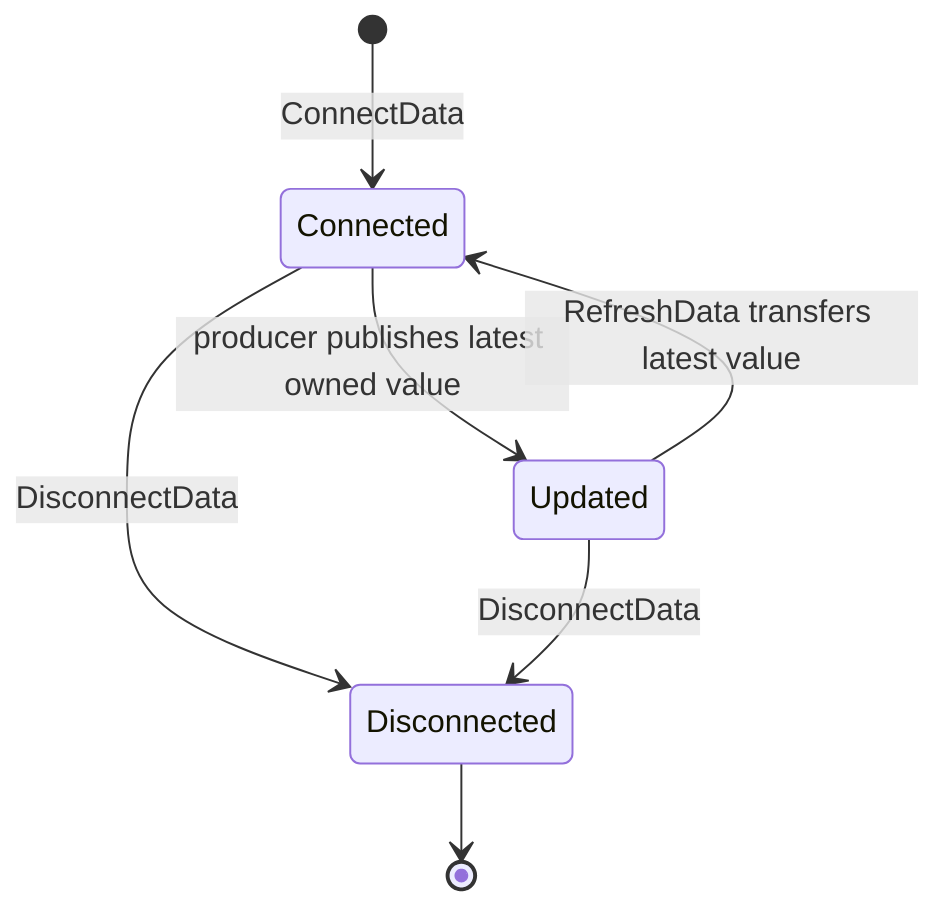

# RTD Streaming Architecture

## M18 research decision

Excel's supported Real-Time Data integration is the COM `IRtdServer`
contract. An ordinary native XLL is not an RTD server. A DLL can participate
only by also being a registered COM class server, with the class factory,
ProgID/CLSID, Automation types, apartment behavior, reference counting, and
deployment obligations that entails.

M18.1 implements the first compatibility prototype as a **separate in-process
COM RTD server DLL**, not the XLL and not a new dependency of the core crates.
This remains a prototype, not production approval. The current host cannot
create a plain workbook, and Microsoft does not specify which physical thread
Excel uses for every RTD call or authorize Excel12/Excel12v in an RTD callback.
No public RTD API is added.

RTD is not approved as an M17 dispatcher wake adapter. `UpdateNotify` asks
Excel to collect RTD topic values through `RefreshData`; neither callback is a
verified Excel C API capability. No RTD path may construct `ThreadSafeContext`,
`WorksheetContext`, `MacroContext`, or `LifecycleContext`, or drain M17 work.

## Verified RTD contract

Excel activates a COM Automation server identified by the `RTD` worksheet
function's ProgID. The server implements every `IRtdServer` method:

| Method | Initiator and purpose | Data and ownership boundary | Excel C API capability |
|---|---|---|---|
| `ServerStart` | Excel, immediately after activation | Supplies an `IRTDUpdateEvent` interface; the server retains a COM reference only for its active lifetime | None documented |
| `ConnectData` | Excel, when a new topic is requested | Excel assigns a 32-bit topic ID; topic components arrive as a one-dimensional Variant array; returns an initial Variant value | None documented |
| `RefreshData` | Excel, after notification when it is ready to collect | Server returns a two-dimensional Variant array pairing topic IDs with values and reports the topic count | None documented |
| `DisconnectData` | Excel, when a topic is no longer needed | Identifies the Excel-assigned topic ID; the server retires the topic | None documented |
| `Heartbeat` | Excel, after the configured quiet interval | Positive means active; zero or negative reports failure | None documented |
| `ServerTerminate` | Excel, when it terminates the RTD connection | Stops the server relationship and releases callback/topic state | None documented |
| `UpdateNotify` | Server, through the supplied COM callback | A notification only; Excel later calls `RefreshData` | None documented |

Microsoft documents these as COM calls, not XLL callbacks. COM delivers each
call according to the object's registered threading model and marshaling
rules. The Learn RTD pages do not promise Excel's main thread, a particular
apartment thread, or legal Excel C API access. Main-thread observations in a
test would not by themselves establish a C API capability.

## Ownership model

- Excel owns the topic IDs and chooses their 32-bit values. The server keys
  internal state by ID and deep-copies any topic text it retains.
- Cross-thread producer messages contain only owned Rust data. No incoming
  `VARIANT`, `BSTR`, `SAFEARRAY`, reference, or interface pointer is borrowed
  across a call or apartment.
- The callback interface is reference-counted from successful `ServerStart`
  until shutdown. Crossing apartments requires a COM proxy obtained through
  normal marshaling, such as the Global Interface Table; a raw interface
  pointer is never copied to a worker.
- `RefreshData` materializes fresh Automation-owned return data. Its
  `VARIANT`/`SAFEARRAY`/`BSTR` cleanup follows Automation rules and is wholly
  separate from XLOPER12, `xlFree`, `xlbitDLLFree`, and `xlAutoFree12`.
- The initial value vocabulary must remain closed until current Excel accepts
  each exact `VARTYPE`. Microsoft's RTD signature says Variant, but does not
  enumerate a complete current accepted subtype matrix.

`VariantInit`, `VariantClear`, `SafeArrayCreate`, and the exact type-library
signatures form the raw ownership boundary. A future Rust wrapper must make
out-parameter transfer explicit and test partial construction failure.

## State and concurrency model





The future prototype has one bounded topic table and one latest-value slot per
connected topic. Repeated producer updates replace the slot, so memory is
bounded by configured topics rather than update rate. An atomic/coordinated
notification-pending flag coalesces `UpdateNotify` calls. Locks are released
before COM calls.

Shutdown commits `Stopping`, rejects producer updates, prevents new
notifications, stops and joins producers, waits for any already-committed
notification call, revokes marshaled callback access, disconnects topics, and
releases COM references before `Terminated`. A disconnected topic cannot be
recreated by a late producer message. Worker threads never call the Excel C
API.

## Architecture options

| Option | Safety and lifecycle | Deployment and bitness | Complexity/performance | Decision |
|---|---|---|---|---|
| Separate in-process COM DLL | Separates COM reference/unload state from XLL runtime; a defect still crashes Excel | Registered ProgID/CLSID and matching Excel process bitness; sign/package independently | Lowest call overhead; apartment and callback marshaling still required | Selected for a future compatibility prototype |
| Same XLL and COM binary | Couples two independent loaders and unload decisions; XLL close cannot prove COM quiescence | One file but both XLL and COM registration/trust surfaces | Highest lifecycle risk despite fewer artifacts | Rejected as the default architecture |
| Out-of-process COM server | Best crash isolation and independent lifetime | LocalServer registration; COM can marshal across 32/64-bit processes | RPC latency, process supervision, installer and policy complexity | Retained as a future opt-in alternative |
| No RTD; async UDFs | Uses the already bounded one-shot lifecycle | No COM deployment | Does not provide continuous topic streaming | Supported for one-shot work; not an RTD substitute |

Registration-free COM is not assumed. Side-by-side activation requires an
application manifest controlled by the COM client; an add-in cannot presume it
can modify or replace Excel's application manifest. The first prototype plan
therefore uses explicit, reversible per-user COM registration. Per-machine
registration is an installer/admin choice, not a library side effect.

XLL trust and COM activation are separate deployment checks. Signing the XLL
does not establish that policy will activate an RTD COM class, and registering
a class does not prove Excel will accept its RTD formulas. Both artifacts and
all relevant enterprise policy must be tested without weakening global Office
security settings.

## Crate and feature boundary

The implemented prototype layout is:

```text
excel-api             # unchanged Excel C API core; no COM dependency
excel-api-sys         # unchanged XLCALL ABI only
excel-api-macros      # unchanged XLL proc generation
examples/minimal-rtd-server # unpublished cdylib plus platform-neutral model
```

The `windows`/`windows-core` dependencies are target-specific dependencies of
that package only. Its COM implementation is behind `cfg(windows)` and its
state model remains buildable elsewhere. The first supported target is
x86_64-pc-windows-msvc. A reusable `excel-api-rtd` crate and public surface are
deferred until compatibility approval. A 32-bit in-process artifact would
require a separate matching build; an out-of-process server can cross process
bitness through COM marshaling.

## Prototype and approval gates

The prototype pins the installed Office 1.9 raw dual-interface ABI, implements
one bounded `COUNTER` catalogue (64 Excel topic IDs, 32 values per refresh),
uses latest-value coalescing and one outstanding notification intent, marshals
the callback through the GIT, and returns fresh `VT_VARIANT` SAFEARRAYs with
Automation ownership. It exports only `DllGetClassObject` and
`DllCanUnloadNow`, and calls neither Excel12 nor Excel12v.

The exact state transitions are `Created -> Started -> Active -> Stopping ->
Terminated`; failed producer startup rolls back to `Created`. A topic is
connected, becomes dirty as its owned counter advances, is marked delivered by
a successful refresh, and is retired by disconnect or server termination.
`DllCanUnloadNow` is `S_OK` only when object, server lock, active server,
producer, GIT-cookie, and committed notification counts are all zero.

Production approval requires the complete matrix in
`docs/manual-tests/m18-rtd-validation.md`. Unit tests can prove state,
ownership, coalescing, and FFI layout, but cannot prove Excel activation,
callback behavior, policy acceptance, or unload safety.

## Authoritative sources

- [Microsoft Excel IRtdServer object](https://learn.microsoft.com/en-us/office/vba/api/excel.irtdserver)
- [Excel PIA IRtdServer interface and IID](https://learn.microsoft.com/en-us/dotnet/api/microsoft.office.interop.excel.irtdserver?view=excel-pia)
- [ServerStart](https://learn.microsoft.com/en-us/office/vba/api/excel.irtdserver.serverstart)
- [ConnectData](https://learn.microsoft.com/en-us/office/vba/api/excel.irtdserver.connectdata)
- [RefreshData](https://learn.microsoft.com/en-us/office/vba/api/excel.irtdserver.refreshdata)
- [DisconnectData](https://learn.microsoft.com/en-us/office/vba/api/excel.irtdserver.disconnectdata)
- [Heartbeat](https://learn.microsoft.com/en-us/office/vba/api/excel.irtdserver.heartbeat)
- [IRTDUpdateEvent.UpdateNotify](https://learn.microsoft.com/en-us/office/vba/api/excel.irtdupdateevent.updatenotify)
- [Office RTD formula implementation notes](https://learn.microsoft.com/en-us/openspecs/office_standards/ms-oi29500/70a4382f-51c6-4640-851d-d8612b038217)
- [Microsoft RTD server walkthrough](https://learn.microsoft.com/en-us/previous-versions/office/troubleshoot/office-developer/create-realtimedata-server-in-excel)
- [COM processes, threads, and apartments](https://learn.microsoft.com/en-us/windows/win32/com/processes--threads--and-apartments)
- [Accessing interfaces across apartments](https://learn.microsoft.com/en-us/windows/win32/com/accessing-interfaces-across-apartments)
- [In-process server threading](https://learn.microsoft.com/en-us/windows/win32/com/in-process-server-threading-issues)
- [COM registration](https://learn.microsoft.com/en-us/windows/win32/com/registering-com-servers)
- [Process interoperability](https://learn.microsoft.com/en-us/windows/win32/winprog64/process-interoperability)
- [VariantClear ownership behavior](https://learn.microsoft.com/en-us/windows/win32/api/oleauto/nf-oleauto-variantclear)
