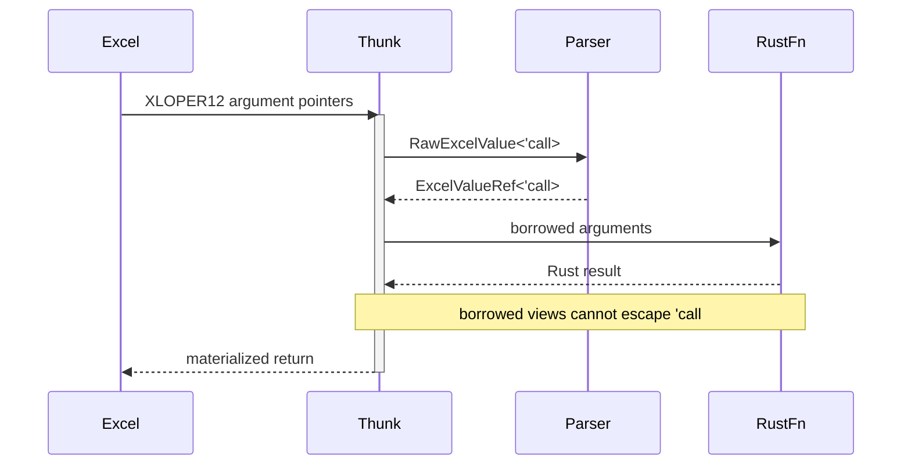

# Input callback lifetime

```mermaid
sequenceDiagram
    participant Excel
    participant Thunk
    participant Parser
    participant RustFn
    Excel->>Thunk: XLOPER12 argument pointers
    activate Thunk
    Thunk->>Parser: RawExcelValue<'call>
    Parser-->>Thunk: ExcelValueRef<'call>
    Thunk->>RustFn: borrowed arguments
    RustFn-->>Thunk: Rust result
    Note over Thunk,RustFn: borrowed views cannot escape 'call
    Thunk-->>Excel: materialized return
    deactivate Thunk
```
