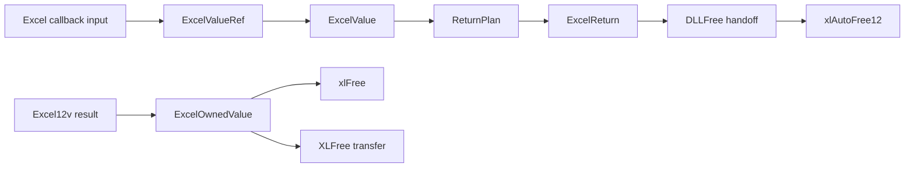

```mermaid
flowchart LR
IN[Excel callback input] --> BORROW[ExcelValueRef]
BORROW --> OWN[ExcelValue]
OWN --> PLAN[ReturnPlan]
PLAN --> RET[ExcelReturn]
RET --> DLL[DLLFree handoff]
DLL --> AF[xlAutoFree12]
API[Excel12v result] --> EXOWN[ExcelOwnedValue]
EXOWN --> FREE[xlFree]
EXOWN --> XLF[XLFree transfer]
```
