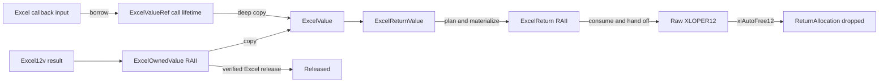

# Memory ownership model

```mermaid
flowchart LR
    A[Excel callback input] -->|borrow| B[ExcelValueRef call lifetime]
    B -->|deep copy| C[ExcelValue]
    C --> D[ExcelReturnValue]
    D -->|plan and materialize| E[ExcelReturn RAII]
    E -->|consume and hand off| F[Raw XLOPER12]
    F -->|xlAutoFree12| G[ReturnAllocation dropped]
    H[Excel12v result] --> I[ExcelOwnedValue RAII]
    I -->|copy| C
    I -->|verified Excel release| J[Released]
```
