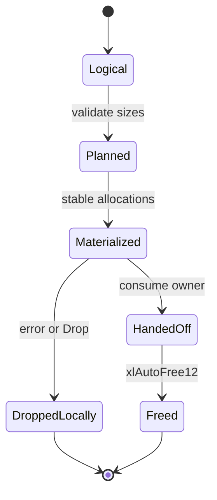

# Return allocation lifecycle

```mermaid
stateDiagram-v2
    [*] --> Logical
    Logical --> Planned: validate sizes
    Planned --> Materialized: stable allocations
    Materialized --> DroppedLocally: error or Drop
    Materialized --> HandedOff: consume owner
    HandedOff --> Freed: xlAutoFree12
    DroppedLocally --> [*]
    Freed --> [*]
```

Handoff must be the final non-fallible operation in an exported thunk.
