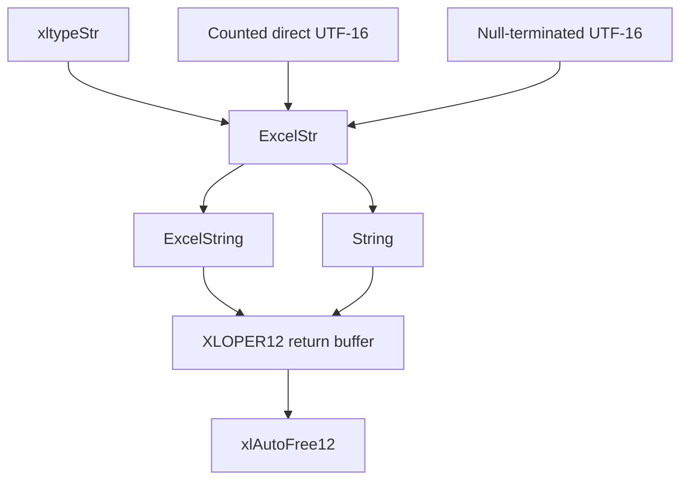

```mermaid
flowchart TD
XS[xltypeStr] --> ES[ExcelStr]
COUNT[Counted direct UTF-16] --> ES
NUL[Null-terminated UTF-16] --> ES
ES --> EO[ExcelString]
ES --> RS[String]
EO --> XB[XLOPER12 return buffer]
RS --> XB
XB --> AF[xlAutoFree12]
```
